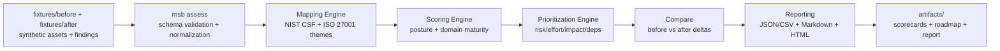

# Multi-Cloud Security Baseline | 30% Posture Improvement
Role: Cloud Security / DevSecOps Consultant (NIST/ISO-aligned)

A multi-cloud company needed a stronger security baseline and a practical roadmap. I performed a baseline assessment across cloud environments, mapped findings to NIST/ISO control themes, and prioritized remediation actions across IAM, logging, network controls, and governance. Outcome: ~30% posture improvement and a clear path toward stronger compliance readiness.

This repository is a **safe, fully local simulation** of that engagement. It uses **synthetic assets and findings** (fixtures) to demonstrate how I structure a baseline assessment, normalize evidence, map to NIST CSF + ISO 27001 themes, compute posture scores, and produce an executive-friendly roadmap — **without any real cloud credentials, scanning, or external API calls**.

## Business challenge
Multi-cloud growth created inconsistent security controls across environments. Leadership needed a baseline view that was:
- Comparable across clouds (normalized findings and scoring)
- Mapped to recognizable frameworks (NIST CSF + ISO 27001 themes)
- Actionable (prioritized remediation backlog + phased roadmap)

## Strategic approach
1) Normalize findings into a strict schema so posture can be measured consistently across AWS/Azure/GCP.
2) Map findings to NIST CSF functions/categories and ISO 27001 control themes for compliance-readiness narrative.
3) Compute deterministic posture scores and maturity by domain.
4) Prioritize remediation by risk, effort, impact, dependencies, and blast radius.
5) Produce executive artifacts (scorecards, roadmap, framework coverage summary).

## Technical execution
- **Fixtures** represent multiple simulated targets (e.g., `aws-prod`, `azure-prod`, `gcp-prod`) and their synthetic findings.
- **Mapping engine** assigns NIST CSF and ISO 27001 themes using explicit mapping tables shipped with the repo.
- **Scoring engine** computes per-target and org-wide posture and domain maturity.
- **Prioritization engine** converts findings into a remediation backlog and phased roadmap.
- **Reporting** generates JSON/CSV outputs plus Markdown + HTML reports (PDF-ready via browser print).

## Quantifiable results
The demo includes `fixtures/before` and `fixtures/after`. Running the comparison computes an improvement that rounds to **~30%**.

## Lasting value
This project demonstrates how to build a repeatable baseline assessment system that supports:
- Consistent posture measurement across clouds
- Framework-aligned reporting for governance and audit readiness
- A practical remediation roadmap for engineering teams

## Mermaid architecture diagram


## How to Run the Demo
Primary path (recommended): `uv`
```bash
cd multicloud-security-baseline-nist-iso-demo
uv sync
uv run msb demo
```

Alternative path: `venv` + `pip`
```bash
cd multicloud-security-baseline-nist-iso-demo
python3 -m venv .venv
source .venv/bin/activate
python -m pip install -U pip
python -m pip install -r requirements.txt
python -m pip install -r requirements-dev.txt
msb demo
```

Key outputs (generated under `artifacts/`):
- `artifacts/before/summary.json`
- `artifacts/after/summary.json`
- `artifacts/compare/compare.json`
- `artifacts/report/report.md`
- `artifacts/report/report.html`
- `artifacts/report/remediation_backlog.csv`
- `artifacts/report/roadmap.csv`

## Validation / Quality Checks
Run everything (lint, format check, type check, tests, smoke, and demo generation):
```bash
make validate
```

Run the demo only:
```bash
make demo
```

## Sample Outputs / Demo Evidence
After `msb demo`, open:
- `artifacts/report/report.html` (PDF-ready via browser print)
- `artifacts/report/report.md`

And inspect machine outputs:
- `artifacts/compare/compare.json`
- `artifacts/report/controls_coverage.csv`

## Why This Demonstrates Senior Expertise
- **Framework alignment without cargo-culting:** explicit mapping tables + rationale fields for traceability.
- **Deterministic, testable scoring:** posture and maturity models are stable and validated by tests.
- **Executive + engineering outputs:** scorecards + roadmap + backlog with rationale and dependencies.
- **Safe-by-design demo boundary:** no credentials, no scanning, no external calls — only local fixtures.
- **Production-grade hygiene:** typed schemas, modular architecture, CI, and a single validation command.

## Trade-offs and Assumptions
- This is a **simulation**: fixtures approximate real findings but do not represent any customer environment.
- Mapping is **high-level and practical** (themes and categories) rather than audit-grade control-by-control attestation.
- Scoring is **deterministic and explainable**, not ML-based; the goal is repeatability and consulting clarity.
- “~30% improvement” is computed from the shipped before/after datasets and rounds to ~30% for narrative clarity.

## License
See `LICENSE`. Personal, educational, and non-commercial use is permitted. Commercial use requires a paid commercial license and written authorization from:
- Freddy D. Alvarez — `falvarezpinto@gmail.com`
